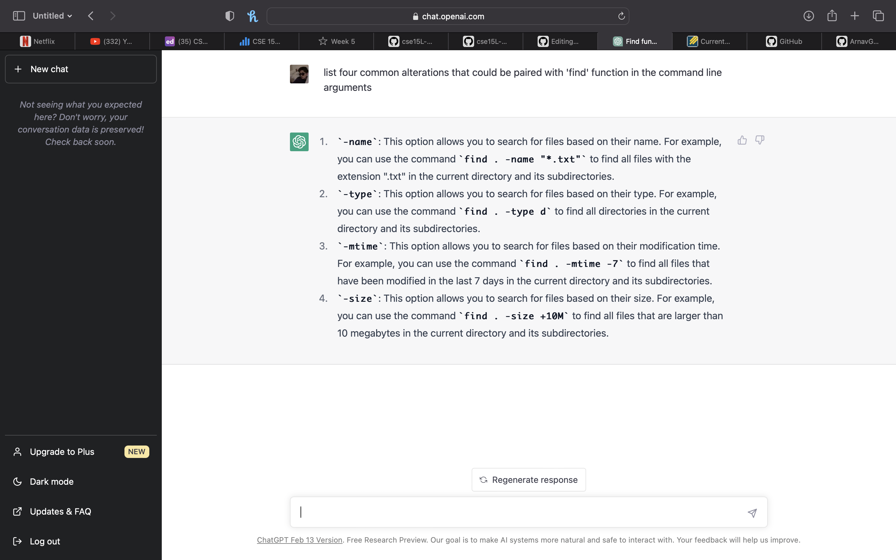

# Interesting commands to pair up with 'find'

This lab report is mostly focussing on the fun modifications that can be used with the 'find' function on the command line to boost our productivity and pace. I chose this task primarily because it helps me increase my knowledge about these commands which I otherwise wouldn't explore. I also lowkey loves the lab-report 3 which made me biased towards selecting this.

Before Using these commands I switched the working directory to an inner directory to make the work of using the 'find' command easier. It can be done using the following commands after cloning the docsearch directory provided by the instructor. The steps are provided with the assumption that a successfull connection with remote server has already been established.

```

cd docsearch
cd written_2/  

```


### 1). -name: 
- The -name option in the find command is used to search for files by their name. It can be used to search for specific files, files with a certain extension, or files that match a certain pattern. This makes it a powerful tool for locating files on a Unix or Linux system.


#### Examples -


##### Example 1 - Prompt with output 
```
Input - 

find -name "Nepal-History.txt"

Output -

./travel_guides/berlitz2/Nepal-History.txt

```
This basically fetches all the lines while looking for all the files in the directory recursively. It printed out the file names along with specific lines that had them.


##### Example 2 - Prompt with output 
```
Input -

find -name "ch?.txt" 

Output -

./non-fiction/OUP/Abernathy/ch1.txt
./non-fiction/OUP/Abernathy/ch2.txt
./non-fiction/OUP/Abernathy/ch3.txt
./non-fiction/OUP/Abernathy/ch6.txt
./non-fiction/OUP/Abernathy/ch7.txt
./non-fiction/OUP/Abernathy/ch8.txt
./non-fiction/OUP/Abernathy/ch9.txt
./non-fiction/OUP/Berk/ch1.txt
./non-fiction/OUP/Berk/ch2.txt
./non-fiction/OUP/Berk/ch7.txt
./non-fiction/OUP/Castro/chA.txt
./non-fiction/OUP/Castro/chB.txt
./non-fiction/OUP/Castro/chC.txt
./non-fiction/OUP/Castro/chL.txt
./non-fiction/OUP/Castro/chM.txt
./non-fiction/OUP/Castro/chN.txt
./non-fiction/OUP/Castro/chO.txt
./non-fiction/OUP/Castro/chP.txt
./non-fiction/OUP/Castro/chQ.txt
./non-fiction/OUP/Castro/chR.txt
./non-fiction/OUP/Castro/chV.txt
./non-fiction/OUP/Castro/chW.txt
./non-fiction/OUP/Castro/chY.txt
./non-fiction/OUP/Castro/chZ.txt
./non-fiction/OUP/Fletcher/ch1.txt
./non-fiction/OUP/Fletcher/ch2.txt
./non-fiction/OUP/Fletcher/ch5.txt
./non-fiction/OUP/Fletcher/ch6.txt
./non-fiction/OUP/Fletcher/ch9.txt
./non-fiction/OUP/Kauffman/ch1.txt
./non-fiction/OUP/Kauffman/ch3.txt
./non-fiction/OUP/Kauffman/ch4.txt
./non-fiction/OUP/Kauffman/ch5.txt
./non-fiction/OUP/Kauffman/ch6.txt
./non-fiction/OUP/Kauffman/ch7.txt
./non-fiction/OUP/Kauffman/ch8.txt
./non-fiction/OUP/Kauffman/ch9.txt
./non-fiction/OUP/Rybczynski/ch1.txt
./non-fiction/OUP/Rybczynski/ch2.txt
./non-fiction/OUP/Rybczynski/ch3.txt

```
This is essentially the same thing as the last set of commands just with the difference of the string being searched for.


### 2). -type: 
- The -type option in the find command is used to search for files based on their type. This option takes a single character argument and matches it against the type of each file in the directory tree being searched. The matched files are then returned as the output of the find command. It can be used to find all directories, all regular files, or all symbolic links, for example.


#### Examples -


##### Example 1 - Prompt with output 
```
Input -

find -type d 

Output -

.
./non-fiction
./non-fiction/OUP
./non-fiction/OUP/Abernathy
./non-fiction/OUP/Berk
./non-fiction/OUP/Castro
./non-fiction/OUP/Fletcher
./non-fiction/OUP/Kauffman
./non-fiction/OUP/Rybczynski
./travel_guides
./travel_guides/berlitz1
./travel_guides/berlitz2

```

This examples builds up on what we learnt about -r in the last section for ease in exploring all the files. It also inclused the '-l' which just prints the file name whilst leaving out the line content which has this string.


##### Example 2 - Prompt with output 
```
Input - 

find ./non-fiction/OUP/Abernathy -type f

Output -

./non-fiction/OUP/Abernathy/ch1.txt
./non-fiction/OUP/Abernathy/ch14.txt
./non-fiction/OUP/Abernathy/ch15.txt
./non-fiction/OUP/Abernathy/ch2.txt
./non-fiction/OUP/Abernathy/ch3.txt
./non-fiction/OUP/Abernathy/ch6.txt
./non-fiction/OUP/Abernathy/ch7.txt
./non-fiction/OUP/Abernathy/ch8.txt
./non-fiction/OUP/Abernathy/ch9.txt

```

Similar to the last case we came across just with a different string 'bye' .


### 3). -mtime: 
- The -mtime option in the find command is used to search for files based on their modification time. It can be used to find all files modified within a certain timeframe, such as within the last day or week. This option takes a numeric argument that specifies the number of 24-hour periods (or days) ago the file was last modified. The matched files are then returned as the output of the 'find' command.


#### Examples -

##### Example 1 - Prompt with output 
```
Input - 

find ./non-fiction/OUP/Abernathy -mtime -1 -type d

Output -

./non-fiction/OUP/Abernathy

```
It's the same command used in the first examples of the two alterations we explored above but with another modification '-i'. This makes the search case insentive and helps us focus on the word rather than the specifc formatting of it and we end up matching with more of the files/


##### Example 2 - Prompt with output 
```
Input - 

find ./non-fiction/OUP/Abernathy -mtime -7

Output -

./non-fiction/OUP/Abernathy
./non-fiction/OUP/Abernathy/ch1.txt
./non-fiction/OUP/Abernathy/ch14.txt
./non-fiction/OUP/Abernathy/ch15.txt
./non-fiction/OUP/Abernathy/ch2.txt
./non-fiction/OUP/Abernathy/ch3.txt
./non-fiction/OUP/Abernathy/ch6.txt
./non-fiction/OUP/Abernathy/ch7.txt
./non-fiction/OUP/Abernathy/ch8.txt
./non-fiction/OUP/Abernathy/ch9.txt

```

The same case as previous but implemented using a different string/


### 4). -size: 
- The -size option is useful in situations where you want to search for files based on their size. It can be used to find files that are taking up a lot of disk space, or files that are smaller than a certain size. This option takes a numeric argument and matches it against the size of each file in the directory tree being searched. 

#### Examples -

##### Example 1 - Prompt with output 
```
Input -

find -size +200k

Output -

./travel_guides/berlitz1/WhereToFrance.txt
./travel_guides/berlitz1/WhereToItaly.txt
./travel_guides/berlitz2/Canada-WhereToGo.txt

```

This commands adds the speific line number on which the word is found on top of the text from the line. The same can be seen in this example as the line number 32 is printed in the output.


##### Example 2 - Prompt with output 
```
Input - 

find -size +100k

Output - 

./non-fiction/OUP/Berk/CH4.txt
./non-fiction/OUP/Berk/ch2.txt
./travel_guides/berlitz1/WhereToFrance.txt
./travel_guides/berlitz1/WhereToIndia.txt
./travel_guides/berlitz1/WhereToItaly.txt
./travel_guides/berlitz1/WhereToJapan.txt
./travel_guides/berlitz1/WhereToMalaysia.txt
./travel_guides/berlitz2/Canada-WhereToGo.txt
./travel_guides/berlitz2/China-WhereToGo.txt
./travel_guides/berlitz2/Portugal-WhereToGo.txt

```

Note - This command can't be paired up with '-l' as '-l' excludes the line altogther making the concept of outputting line numbers and thus using '-n' redundant & useless. This can be clearly concluded from the example above.


***

## Softwares used - Chat GPT


- I used ChatGPT for aiding me in the completion of this project. I prompted it with four commands specifically-  One for asking about 4 commands that could be paired up with the 'find' function and the rest of them for the usefullness of those functions. The same can be recreated by following these given steps ~


1). [Click here](https://openai.com/blog/chatgpt/) to head to the chat Gpt website and then clcik on the try GPT option followed by a signup to create an account. 

The website upon clicking at first would look something like this ~


2). Upon succesfull login inot your account the webpage would look something like this. Click on the new Chat button to proceed.


3).Enter the derised prompt (Instructions) for the Chat gpt to generate text and then hit enter or the arror button on the right of the text box.


4). A sample input and output has been attached underneath. 




***
***


